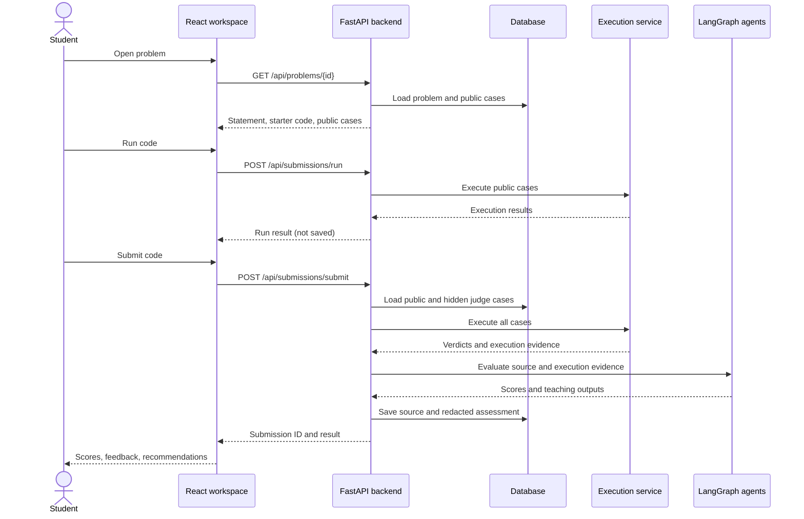
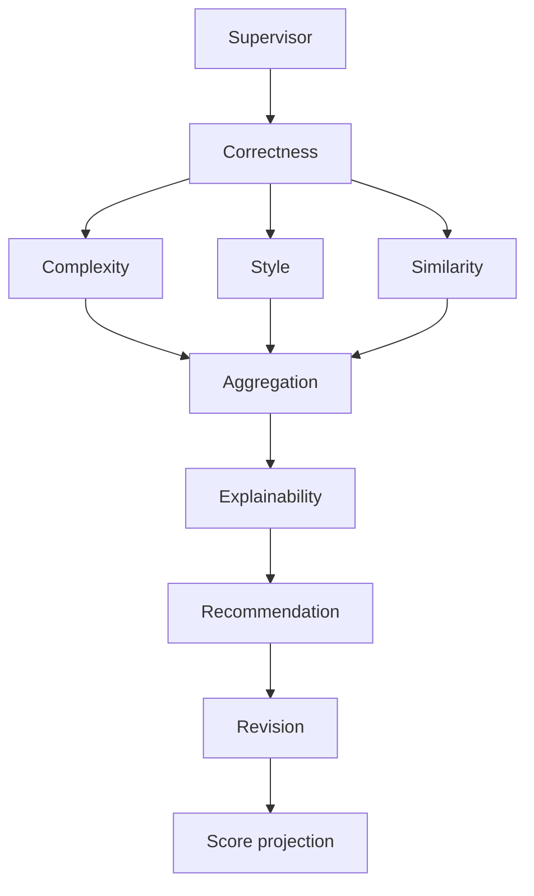

# CodeAssessment

An explainable, multi-agent code assessment platform for programming education. Students solve problems, execute code, and receive scores with improvement feedback. Instructors explore assignments, student progress, analytics, and reports.

The interface also uses the names **CodeVedha** and **Kodacharya**. The project combines working backend features with demo interfaces and fallback AI responses.

## Contents

- [Features](#features)
- [Technology and architecture](#technology-and-architecture)
- [Complete project workflow](#complete-project-workflow)
- [Assessment workflow and scoring](#assessment-workflow)
- [Data and frontend structure](#data-and-frontend-structure)
- [Setup and configuration](#quick-start)
- [API reference](#api-reference)
- [Repository map](#repository-map)
- [Tests and datasets](#tests-and-datasets)
- [Implementation limits](#important-implementation-limits)
- [Troubleshooting and maintenance](#troubleshooting-and-maintenance)

## Features

- **Student workspace:** problem catalogue, Monaco editor, public test runs, submissions, feedback, and history.
- **Assessment:** correctness, complexity, style, and similarity analysis, followed by explanations, recommendations, revised code, and score projections.
- **Instructor interface:** problems, courses, roster, analytics, similarity review, and reports. Some management features use mock or browser state.
- **Execution:** Python, C, C++, Java, and JavaScript through a separate execution service.
- **Storage:** PostgreSQL with Docker Compose; SQLite for local backend development.
- **Datasets:** import and normalization tools for APPS, CodeContests, and NewFacade.

## Technology and architecture

| Component | Technologies | Responsibility |
| --- | --- | --- |
| Frontend | React 19, Vite, Tailwind CSS, Monaco, Recharts | Student/instructor interfaces |
| Backend | Python 3.11, FastAPI, Pydantic, SQLAlchemy | APIs, submissions, persistence, analytics |
| Assessment | LangGraph, LangChain, Groq | Agent orchestration and feedback |
| Execution service | FastAPI, Docker | Compile programs and judge test cases |
| Database | PostgreSQL 16 / SQLite | Problems, students, cases, submissions |

```text
React frontend :5173
        |
        | /api through Vite proxy
        v
FastAPI backend :8000 ──── PostgreSQL
        |
        ├── Execution service :8001 ─── Language containers
        └── LangGraph workflow ──────── Groq / fallback responses
```

## Complete project workflow

### 1. Start services and prepare data

Docker Compose starts PostgreSQL, the execution service, the backend, and the frontend. The backend creates missing database tables and inserts missing built-in instructor problems and their judge cases. Additional practice problems come from dataset imports or an existing database. Restarting does not overwrite existing instructor assignments.

The frontend sends `/api` requests through Vite to FastAPI. FastAPI owns problem retrieval, execution requests, assessment orchestration, and database writes; the browser does not directly access PostgreSQL or Groq.

### 2. Sign in and select a problem

`AuthContext.jsx` calls `/api/auth/login` with an identifier and role. The demo backend creates an unknown student if needed and returns profile information. The browser stores a session marker and routes the user to student or instructor views.

The student catalogue calls `/api/problems`; the instructor catalogue calls `/api/instructor-problems`. Opening a problem calls `/api/problems/{id}` for its statement, constraints, examples, starter code, and public cases. Private judge cases stay server-side.

This is demo identity handling: passwords are not validated, and the current editor/history paths use a fixed student ID. Browser role routing is not backend authorization.

### 3. Write code and run public tests

The Monaco workspace collects the language and source. **Run** calls `/api/submissions/run`. When a problem ID is supplied, the backend loads its public cases; otherwise the endpoint can accept supplied cases for a custom run.

The backend execution client prepares supported solution wrappers, calls the execution engine, and returns compilation status, verdicts, output, errors, timing, and case counts. This path does not call the assessment graph or create a saved submission.

### 4. Submit for full judging

**Submit** sends `student_id`, `problem_id`, `language`, and `code` to `/api/submissions/submit`. The backend loads authoritative cases from `problem_test_cases`, falling back to legacy problem JSON when normalized records are absent. Request-supplied cases do not replace the final judge cases.

The backend asks the execution engine to run all cases, including hidden cases, without stopping after the first failure. The engine resolves the language, compiles when necessary, executes cases with bounded concurrency, and reports results. Docker runners apply network, filesystem, process, CPU, and memory restrictions.

Programs must follow the selected problem's input/output format. The backend has wrappers for some function/class-style solutions, but these are not universal. Local-process fallback paths also exist when engine/Docker execution is unavailable; see the implementation limits below.

### 5. Evaluate and explain

Execution results, source, language, student information, and the problem statement/constraints form `EvaluationState`. LangGraph runs the ten stages described below. Correctness comes from test results; complexity, style, and similarity branch in parallel before aggregation and teaching feedback.

The shared agent helper loads prompts, calls Groq, parses JSON, and validates the response. If a call is unavailable or invalid, that agent uses its fallback. The correctness agent removes selected hidden-case details before constructing its model payload.

### 6. Save and display the result

After the graph finishes, the backend removes hidden-case input, expected output, actual output, and stderr from per-case execution records before persistence and response. It generates a `SUB-XXXXXXXX` ID and saves source, component scores, execution results, feedback, recommendations, revised code, and score projection.

The frontend receives the assessment and shows the result. `EVALUATED` means the pipeline finished; it does not mean every case passed or every agent successfully called the model. Suggested revised code is not re-executed by this workflow.

Submission processing completes within the original HTTP request. There is no durable background submission job or polling API in this path.

### 7. Review history and instructor views

History is retrieved through `/api/submissions?student_id=...`; a saved result and original source are available through `/api/submissions/{submission_id}`. The initial response includes some details, such as complexity analysis, that are not persisted as dedicated submission fields.

Student analytics and the instructor overview query stored submissions but also include demonstration defaults. Courses, roster management, similarity alerts, and reports have interface/state implementations without a complete set of persistent management APIs. A change in one of these views may therefore remain only in browser or in-memory state.

### Request sequence



## Assessment workflow



| Stage | Role |
| --- | --- |
| Supervisor | Produces validation information; execution has already occurred. |
| Correctness | Calculates the passing-case percentage and explains failures. |
| Complexity | Infers time/space complexity and compares it with explicit problem requirements. |
| Style | Evaluates readability and code quality. |
| Similarity | Produces a similarity estimate; the active agent does not retrieve peer submissions. |
| Aggregation | Calculates the overall score from available components. |
| Explainability | Turns assessment evidence into feedback. |
| Recommendation | Suggests learning actions. |
| Revision | Suggests improved code and explains changes. |
| Projection | Estimates possible score improvement. |

Prompts live in `backend/prompts/`, implementations in `backend/agents/`, and graph/state definitions in `backend/workflow/`. Groq responses are validated with Pydantic. Missing credentials or failed/invalid responses trigger agent-specific fallbacks.

### Scoring

| Component | Base weight |
| --- | ---: |
| Correctness | 40% |
| Complexity | 20% |
| Style | 20% |
| Originality (`100 − similarity`) | 10% |
| Execution (compilation success) | 10% |

- **Correctness:** accepted cases ÷ evaluated cases × 100; compilation failure gives zero.
- **Complexity:** supported Big-O classes are ranked; each rank worse than the expected class subtracts 20 from 100. When both are available, time contributes 70% and space 30%.
- **Overall:** weighted average, rounded to one decimal. Unavailable components are excluded and remaining weights are renormalized.

For correctness 80, complexity 60, style 90, originality 85, and successful compilation, the overall score is **80.5**. Correctness and overall scores are calculated in Python; model output supplies supporting assessment and explanations.

## Data and frontend structure

| Database table | Stores |
| --- | --- |
| `students` | Identity, profile, XP, and streak fields |
| `problems` | Statements, examples, constraints, starter code, source metadata, and legacy cases |
| `problem_test_cases` | Ordered public/hidden cases with time and memory limits |
| `submissions` | Student/problem references, source, scores, redacted execution results, and teaching outputs |

Students and problems each have many submissions; problems have many test cases. The backend prefers normalized case rows and supports older JSON cases. Missing instructor problems are seeded at startup without replacing existing records. Tables are created automatically; no versioned migration workflow is included.

Detailed complexity analysis is returned on initial submission but is not stored as a submission column. Some graph details therefore do not survive a later result fetch.

**Frontend navigation:** student routes cover dashboard, problems/editor, submissions/results, analytics, feedback, profile, and settings. `/instructor/*` contains instructor views. `src/App.jsx` defines active routes, `AuthContext.jsx` manages demo sessions, and `AppContext.tsx` combines shared state, mock data, and server-loaded history. Active feature views mostly live under `src/components/`.

## Quick start

### Requirements

Git, Docker with Docker Compose, and an optional Groq API key for model-generated feedback.

```bash
git clone https://github.com/multiagentcodereview2026/CodeAssessment.git
cd CodeAssessment
```

Create `backend/.env` (required by Compose, even without an API key):

```dotenv
GROQ_API_KEY=
GROQ_MODEL=llama-3.3-70b-versatile
```

Optionally set `POSTGRES_PASSWORD` in a root `.env` to override the Compose development password.

Pull the images used by the active execution service, then start the application:

```bash
docker pull python:3.11-slim
docker pull gcc:13
docker pull eclipse-temurin:17-jdk
docker pull node:20-slim
docker compose up --build -d
```

| Service | Address |
| --- | --- |
| Application | http://localhost:5173 |
| Backend | http://localhost:8000 |
| API documentation | http://localhost:8000/docs |
| Health check | http://localhost:8000/health |

The root Compose stack keeps execution port 8001 internal. Sign in with a student identifier such as `demo_student` and any password. Instructor assignments are provisioned automatically; the practice catalogue may require a dataset import.

```bash
docker compose logs -f backend execution-engine
docker compose down
```

Stopping without `-v` preserves database volumes.

### Local development

**Frontend:** use Node compatible with the installed Vite version; the Dockerfile uses Node 20.

```bash
cd frontend
npm ci
npm run dev
# Validation/build:
npm run lint
npm run build
```

**Backend:** from the repository root:

```bash
cd backend
python3 -m venv .venv
source .venv/bin/activate
python -m pip install -r requirements.txt
uvicorn main:app --reload --port 8000
```

On Windows, activate with `.venv\Scripts\activate`. A host-run backend needs a reachable execution service; explicitly expose port 8001 when using containers. See [execution architecture](docs/DOCKER_EXECUTION_ARCHITECTURE.md).

### Main configuration

| Variable | Purpose / default |
| --- | --- |
| `GROQ_API_KEY`, `GROQ_MODEL` | Model credentials and selection |
| `DATABASE_URL` | Export in the backend process; local default is `sqlite:///./codeassessment_v2.db` |
| `DOCKER_ENGINE_URL` | Local default: `http://localhost:8001/execute`; Compose sets the service URL |
| `DOCKER_ENGINE_REQUEST_TIMEOUT_SECONDS` | Execution HTTP timeout; 120 seconds |
| `VITE_API_PROXY_TARGET` | Frontend development proxy; defaults to `http://127.0.0.1:8000` |
| `EXECUTION_CPU_LIMIT`, `EXECUTION_MEMORY_LIMIT` | Runner defaults: 1 CPU and 256 MB |
| `EXECUTION_TIMEOUT_SECONDS` | Default 5 seconds; cases can specify limits and runner grace adds time |
| `EXECUTION_MAX_CONCURRENT_JOBS` | Root Compose sets 8 |
| `EXECUTION_SANDBOX_VOLUME` | Root Compose shared volume name; defaults to `codeassessment_execution-work` |

Compose supplies the database/engine connection settings. The built frontend requires deployment API routing; Vite's development proxy is not included in the bundle.

## API reference

| Method | Endpoint | Purpose |
| --- | --- | --- |
| POST | `/api/auth/login` | Demo login |
| GET | `/api/problems` | Practice catalogue |
| GET | `/api/instructor-problems` | Instructor catalogue |
| GET | `/api/problems/{problem_id}` | Statement and public cases |
| POST | `/api/submissions/run` | Execute public or supplied cases |
| POST | `/api/submissions/submit` | Execute, assess, and save |
| GET | `/api/submissions?student_id=...` | Saved history |
| GET | `/api/submissions/{submission_id}` | Saved result and source |
| GET | `/api/analytics/student/{student_id}` | Student analytics |
| GET | `/api/instructor/overview` | Instructor summary |

Example run without a stored problem:

```bash
curl -X POST http://localhost:8000/api/submissions/run \
  -H 'Content-Type: application/json' \
  -d '{"language":"python","code":"print(sum(map(int, input().split())))","test_cases":[{"input":"2 3","expected_output":"5","is_hidden":false}]}'
```

For final submission, send `student_id`, an existing `problem_id`, `language`, and `code`. The server selects judge cases. The response contains a `submission_id`, scores, execution results, and nested feedback/recommendation/revision/projection objects. See `/docs` for complete schemas.

## Repository map

```text
frontend/                   React UI, routes, state, components
backend/
  main.py                   API endpoints and submission lifecycle
  models.py / schemas.py    Database models and API contracts
  agents/ / prompts/        Assessment stages and prompts
  workflow/ / scoring/     Graph, shared state, numerical rules
  docker_runner/            Execution client and solution wrappers
  dataset/                  Import and normalization tools
  tests/                    Backend tests
  instructor_definitions.py Built-in assignments
  instructor_repository.py Assignment seeding and case loading
docker-execution-engine/    Execution API, language configs, sandbox, tests
docker/                     Additional runner Dockerfiles
AI/                         Separate AI pipeline and experiments
database/                   Backup instructions
docs/                       Architecture documentation
docker-compose.yml          Development stack and dataset tools
```

The application uses `backend/workflow`, not the separate `AI/` pipeline. Similarly, active engine language settings reference the standard images listed above, rather than the custom `codeassessment-*` runner images.

## Tests and datasets

Focused assessment tests, from `backend/` with its dependencies installed:

```bash
python -m pytest tests/test_ai_assessment_integration.py -q
```

Execution unit tests, from `docker-execution-engine/`:

```bash
python -m pip install -r requirements.txt
python -m pytest tests/test_sandbox.py -q
```

Live execution tests require Docker and language images. Some older backend tests reference missing modules, including `auth`, so full test collection may fail.

Dataset tools are available under `backend/dataset/` and the Compose `tools` profile. Their mounts expect external dataset directories; prepare data and check paths before importing. Database dumps can contain hidden cases and should stay outside Git. See [backup and restore instructions](database/README.md).

## Important implementation limits

- **Demo identity:** login accepts any password; browser session markers are not real access tokens. Backend routes do not enforce production authentication/authorization. Workspace submission and shared history currently use the fixed student ID `24BD1A058Z`.
- **Mixed data:** analytics include hardcoded defaults and trends; several instructor operations use mock/browser state instead of persistent APIs.
- **AI output:** fallbacks may be generic. The revision fallback is a fixed C++ Two Sum solution. Similarity has no comparison corpus, and projections are estimates rather than verified outcomes.
- **Execution isolation:** Docker runners disable networking and apply resource restrictions, but both execution layers contain local-process fallback paths. An unavailable sandbox does not necessarily stop execution. The service also mounts the host Docker socket.
- **Deployment:** Compose runs the Vite development server and permissive CORS. It is a development setup.

## Troubleshooting and maintenance

| Issue or change | Where to look |
| --- | --- |
| Missing environment file | Create `backend/.env` before starting Compose. |
| Empty practice catalogue | Import practice data; check instructor catalogue separately. |
| Generic feedback | Check Groq configuration and backend fallback logs. |
| Slow or failed execution | Inspect backend/engine logs, runtime images, timeouts, and shared volume name. |
| Wrong student's history | Fixed IDs in `ProblemWorkspace.tsx` and `AppContext.tsx`. |
| Change a page | `frontend/src/App.jsx` and the mounted component. |
| Change scoring or workflow | `backend/agents/`, `scoring/`, and `workflow/`. |
| Add a language | Engine `app/languages.py`, runtime image, backend wrappers, and editor options. |
| README absent from Git status | `.gitignore` explicitly ignores `README.md`; adjust the rule when adding it. |

This guide is based on source inspection. The full stack and test suites were not run during documentation preparation. No license file was present in the inspected repository.
